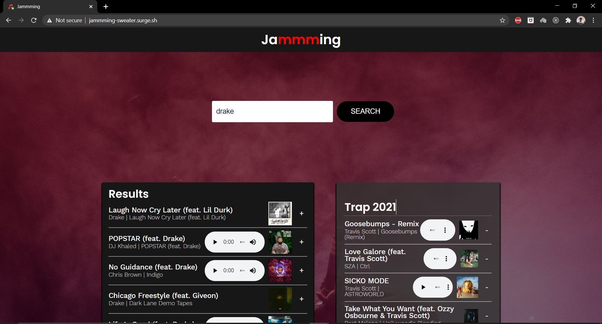

# Jammming Web App

## Description

A web app using Spotify API built to let users create a Spotify playlist. The web app was build using React (mainly React Components).

## Table of Contents

* [Description](#description)
* [Technologies](#technologies)
* [Instructions](#instructions)

## Technologies

### Languages

* HTML5
* CSS3
* JavaScript
* JSX

### Framework / Libraries

* React

### Deployment

* Surge.sh

### Other technologies

* VSCode
* Git
* GitHub

## Instructions

To use the web app, user must have a Spotify account

* [Got to the Jammming website](http://jammming-sweater.surge.sh/)
* Click 'Login to Spotify' (click again if the first click doesn't work-- will fix this bug soon)
* Login to Spotify and allow permission
* Find songs or artist on searchbar
* click '+' button on the song to added to the playlist
* Rename the playlist name
* Click 'Save to Spotify'
* The playlist is already in your Spotify account.